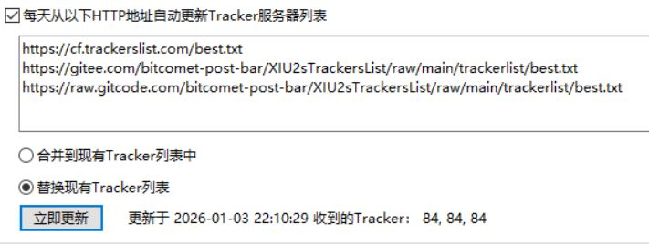

# 关于

本项目用于镜像 [XIU2的TrackersList](https://github.com/XIU2/TrackersListCollection) 到国内git平台  

---

## 订阅地址

### all.txt

* Gitee镜像：[链接](https://gitee.com/bitcomet-post-bar/XIU2sTrackersList/raw/main/trackerlist/all.txt)
* GitCode镜像：[链接](https://raw.gitCode.com/bitcomet-post-bar/XIU2sTrackersList/raw/main/trackerlist/all.txt)


### best.txt

* Gitee镜像：[链接](https://gitee.com/bitcomet-post-bar/XIU2sTrackersList/raw/main/trackerlist/best.txt)
* GitCode镜像：[链接](https://raw.gitCode.com/bitcomet-post-bar/XIU2sTrackersList/raw/main/trackerlist/best.txt)


### http.txt

* Gitee镜像：[链接](https://gitee.com/bitcomet-post-bar/XIU2sTrackersList/raw/main/trackerlist/http.txt)
* GitCode镜像：[链接](https://raw.gitCode.com/bitcomet-post-bar/XIU2sTrackersList/raw/main/trackerlist/http.txt)

### nohttp.txt

* Gitee镜像：[链接](https://gitee.com/bitcomet-post-bar/XIU2sTrackersList/raw/main/trackerlist/nohttp.txt)
* GitCode镜像：[链接](https://raw.gitCode.com/bitcomet-post-bar/XIU2sTrackersList/raw/main/trackerlist/nohttp.txt)

---

## 合并订阅

一些客户端支持同时订阅多个链接 如比特彗星（Bitcomet）  
3个订阅地址中有一个可正常访问时就能完成更新  




### all.txt

```
https://cf.trackerslist.com/all.txt
https://gitee.com/bitcomet-post-bar/XIU2sTrackersList/raw/main/trackerlist/all.txt
https://raw.gitcode.com/bitcomet-post-bar/XIU2sTrackersList/raw/main/trackerlist/all.txt
```

### best.txt


```
https://cf.trackerslist.com/best.txt
https://gitee.com/bitcomet-post-bar/XIU2sTrackersList/raw/main/trackerlist/best.txt
https://raw.gitcode.com/bitcomet-post-bar/XIU2sTrackersList/raw/main/trackerlist/best.txt
```


### http.txt

```
https://cf.trackerslist.com/http.txt
https://gitee.com/bitcomet-post-bar/XIU2sTrackersList/raw/main/trackerlist/http.txt
https://raw.gitcode.com/bitcomet-post-bar/XIU2sTrackersList/raw/main/trackerlist/http.txt
```

### nohttp.txt

```
https://cf.trackerslist.com/nohttp.txt
https://gitee.com/bitcomet-post-bar/XIU2sTrackersList/raw/main/trackerlist/nohttp.txt
https://raw.gitcode.com/bitcomet-post-bar/XIU2sTrackersList/raw/main/trackerlist/nohttp.txt
```

---

## 仓库地址

* GitHub仓库地址：[链接](https://github.com/bitcomet-post-bar/XIU2sTrackersList)
* Gitee仓库地址：[链接](https://gitee.com/bitcomet-post-bar/XIU2sTrackersList)
* GitCode仓库地址：[链接](https://gitCode.com/bitcomet-post-bar/XIU2sTrackersList)


---

## 许可证

GPL-3.0 许可证  

